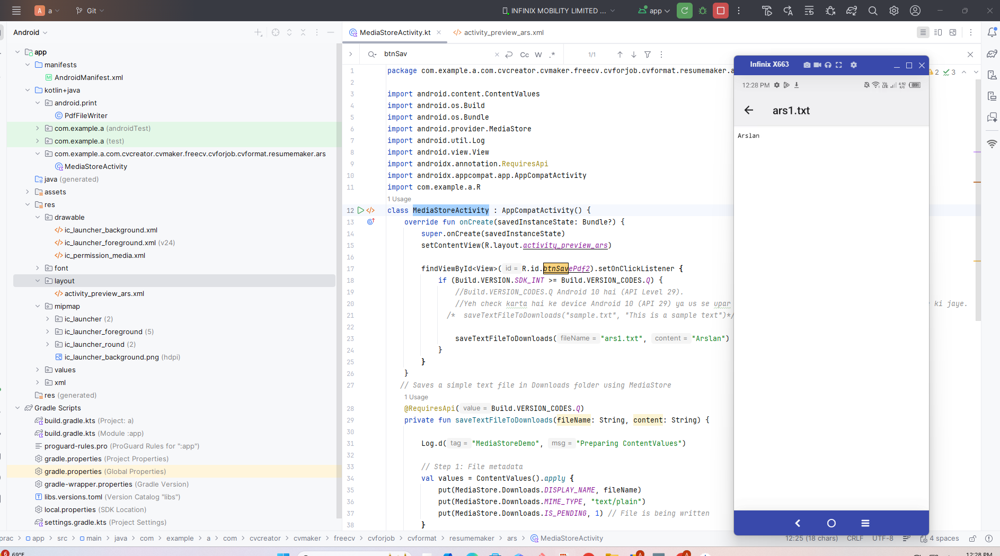

package com.example.a.com.cvcreator.cvmaker.freecv.cvforjob.cvformat.resumemaker.ars

import android.content.ContentValues
import android.os.Build
import android.os.Bundle
import android.provider.MediaStore
import android.util.Log
import android.view.View
import androidx.annotation.RequiresApi
import androidx.appcompat.app.AppCompatActivity
import com.example.a.R
class MediaStoreActivity : AppCompatActivity() {
    override fun onCreate(savedInstanceState: Bundle?) {
        super.onCreate(savedInstanceState)
        setContentView(R.layout.activity_preview_ars)

        findViewById<View>(R.id.btnSavePdf2).setOnClickListener {
            if (Build.VERSION.SDK_INT >= Build.VERSION_CODES.Q) {
                //Build.VERSION_CODES.Q Android 10 hai (API Level 29).
                //Yeh check karta hai ke device Android 10 (API 29) ya us se upar ho, tab hi MediaStore ke zariye text file save ki jaye.
              /*  saveTextFileToDownloads("sample.txt", "This is a sample text")*/
                saveTextFileToDownloads("arslan2223", "hi this is pdf not txt")
            }
        }
    }
   // Saves a simple text file in Downloads folder using MediaStore
    @RequiresApi(Build.VERSION_CODES.Q)
    private fun saveTextFileToDownloads(fileName: String, content: String) {

        Log.d("MediaStoreDemo", "Preparing ContentValues")

        // Step 1: File metadata
        val values = ContentValues().apply {
            put(MediaStore.Downloads.DISPLAY_NAME, fileName)
         //   put(MediaStore.Downloads.MIME_TYPE, "text/plain")
            //for pdf
            put(MediaStore.Downloads.MIME_TYPE, "application/pdf")

            put(MediaStore.Downloads.IS_PENDING, 1) // File is being written
        }

        // Step 2: Insert file entry into MediaStore Downloads
        val uri = contentResolver.insert(
            MediaStore.Downloads.getContentUri(MediaStore.VOLUME_EXTERNAL_PRIMARY),
            values
        )
        if (uri == null) {
            Log.e("MediaStoreDemo", "Failed to create MediaStore entry")
            return
        }
        Log.d("MediaStoreDemo", "MediaStore URI created: $uri")

        // Step 3: Write text content to file
        contentResolver.openOutputStream(uri)?.use { outputStream ->
          //  outputStream.write(content.toByteArray())  change this to pdf

            val pdfDocument = android.graphics.pdf.PdfDocument()
            val pageInfo = android.graphics.pdf.PdfDocument.PageInfo.Builder(300, 400, 1).create()
            val page = pdfDocument.startPage(pageInfo)

            page.canvas.drawText(content, 50f, 100f, android.graphics.Paint())

            pdfDocument.finishPage(page)
            pdfDocument.writeTo(outputStream)
            pdfDocument.close()

            Log.d("MediaStoreDemo", "Text written to file")
        }

        // Step 4: Mark file as completed
        values.clear()
        values.put(MediaStore.Downloads.IS_PENDING, 0)
        contentResolver.update(uri, values, null, null)
        Log.d("MediaStoreDemo", "File saved successfully in Downloads")
    }
}

/*
2️⃣ File extension change karein
OLD
saveTextFileToDownloads("ars1.txt", "Arslan")

NEW
saveTextFileToDownloads("ars1.pdf", "Arslan")
 */

/*
3️⃣ Content ko PDF format mein likhna

❌ Yeh line PDF nahi banati, sirf text likhti hai:
outputStream.write(content.toByteArray())

✔ PDF banane ke liye aapko PdfDocument use karna hoga
Is ek line ko replace karein 👇

✅ MINIMAL PDF WRITE CODE (Replace Step 3)
val pdfDocument = android.graphics.pdf.PdfDocument()
val pageInfo = android.graphics.pdf.PdfDocument.PageInfo.Builder(300, 400, 1).create()
val page = pdfDocument.startPage(pageInfo)

page.canvas.drawText(content, 50f, 100f, android.graphics.Paint())
pdfDocument.finishPage(page)
pdfDocument.writeTo(outputStream)
pdfDocument.close()
 */

